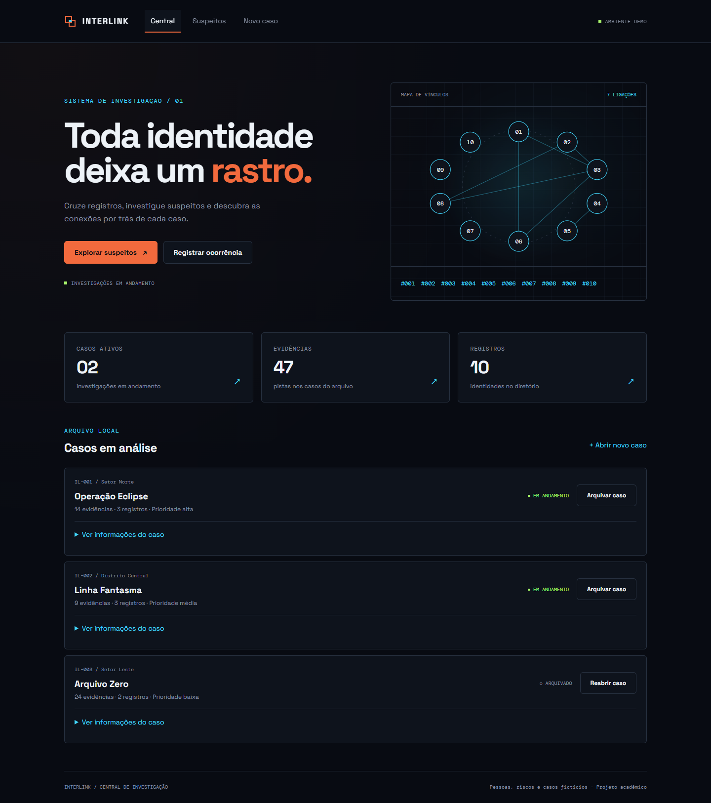

# INTERLINK

Uma central de investigação digital criada para o trabalho **Da capa para a tela**. O conceito é **IDENTIDADE**: conhecer um registro também passa por entender suas conexões.

O ponto de partida é o [pôster oficial de Blade Runner 2049](https://www.warnerbros.it/recap/blade-runner-2049/), dirigido por Denis Villeneuve. A atmosfera vira contraste entre fundo escuro, laranja e ciano, hierarquia de informação e dossiês conectados. A imagem do pôster fica apenas na pesquisa e nos documentos; não faz parte da aplicação.



## Entregáveis

- [Conceito e uso de IA](CONCEITO.md).
- [Moodboard em PDF](docs/moodboard-interlink-blade-runner-2049.pdf): a página 2 reúne as 16 referências em um painel; as seguintes detalham os quatro grupos e a síntese.
- [Identidade visual em PDF](docs/identidade-visual-interlink.pdf): uma página com nome, paleta, tipografia, formas, frase de direção e duas telas; a segunda amplia os desenhos.
- [Fontes das referências](docs/fontes-moodboard.md).
- [Conferência dos requisitos](docs/checklist-entrega.md).
- [Roteiro de apresentação de 5 minutos](docs/roteiro-apresentacao.md).
- [Apresentação em PDF](docs/apresentacao-interlink.pdf) e [PowerPoint editável com notas de fala](docs/apresentacao-interlink.pptx).
- [Guia de código: signals, computed e eventos](docs/guia-codigo-interlink.md), com exemplos e exercícios com gabarito.
- [Capturas do site em computador e celular](docs/telas/).

## Como rodar

Use **Node.js 24.15 ou superior da linha 24 LTS**, com npm. A faixa completa suportada está em `package.json`. O projeto usa Angular 22, TypeScript 6 e Tailwind CSS 4.

```sh
git clone https://github.com/Cerqueira047/projeto-Da-capa-para-a-tela.git
cd projeto-Da-capa-para-a-tela
npm ci
npm start
```

Abra [localhost:4200](http://localhost:4200). É preciso acesso à internet para consultar os registros da API pública; as fontes são arquivos locais, incluídos no projeto.

Para gerar a versão de produção:

```sh
npm run build
```

Os arquivos saem em `dist/interlink/browser`. Uma hospedagem precisa encaminhar rotas como `/suspeitos/3` para `index.html`, porque a navegação é de uma SPA. A atividade pode ser demonstrada com o servidor local; este repositório não configura hospedagem automática.

## O que funciona

1. **Central:** mapa de vínculos, totais calculados e lista de casos. Arquivar ou reabrir um caso muda a contagem de ativos.
2. **Suspeitos:** busca por nome, usuário, cidade ou organização, filtro de risco e filtro de acompanhados. A busca ignora acentos e espaços nas pontas.
3. **Dossiê:** dados de uma pessoa, classificação, casos associados e links para registros que participam dos mesmos casos.
4. **Novo caso:** validação de título, localização e descrição, prioridade e seleção opcional de suspeitos. Vincular duas ou mais pessoas cria conexões entre seus dossiês.

| Rota | Tela |
| --- | --- |
| `/` | Central |
| `/suspeitos` | Busca e filtros |
| `/suspeitos/:id` | Dossiê individual |
| `/novo-caso` | Cadastro de ocorrência |
| `**` | Página 404 dentro do tema |

A rota antiga `/suspeito/:id` redireciona para `/suspeitos/:id`. Um identificador inexistente mostra um estado de dossiê não encontrado.

## Dados e estado

A API [JSONPlaceholder](https://jsonplaceholder.typicode.com/users) fornece os perfis de demonstração. **Pessoas, riscos e casos são fictícios.** Os riscos são classificações de exemplo definidas pelo projeto, não avaliações recebidas da API.

Os casos iniciais têm 47 evidências no total; um caso novo começa com zero. Não há cadastro de evidências nesta versão. Conexões são pares de pessoas que aparecem em um mesmo caso, incluindo casos arquivados, para manter o histórico consultável.

Casos e acompanhamentos ficam no `localStorage` deste navegador. Não há login, sincronização entre dispositivos ou gravação na API. Se o navegador bloquear o armazenamento, a aplicação avisa e mantém as alterações só na sessão. Para retornar à demonstração inicial, limpe os dados do site no navegador.

- `ApiService` usa `inject(HttpClient)` e consulta a API; `DirectoryService` compartilha os registros e os estados de carregamento/erro.
- `CaseStore` guarda casos e acompanhamentos em signals. Totais e conexões são `computed`, derivados dos casos, sem contadores atualizados manualmente.
- A busca e os filtros são signals; a seleção e as contagens são `computed`.
- `SuspectCard`, `StatCard` e `ConnectionMap` recebem dados por `input()`. O `output()` do card avisa ao componente pai quando o acompanhamento muda.
- O formulário reativo converte seus eventos em signal com `toSignal()`, para recalcular a validade e o estado do botão.
- Os templates usam `@if`, `@for` com `track` e `@empty`. O Tailwind organiza layout, responsividade e componentes; CSS próprio complementa fontes e iluminação.

## Verificação

```sh
npx playwright install chromium
npm test
```

Se já houver Google Chrome instalado, no PowerShell também é possível executar:

```powershell
$env:PLAYWRIGHT_CHANNEL='chrome'
npm test
```

Os testes iniciam o servidor automaticamente ou reutilizam uma instância em execução. Há 9 cenários em dois tamanhos de tela (18 verificações): navegação, busca, acompanhamento, cadastro, vínculos, carregamento/erro, resposta vazia, armazenamento indisponível e ausência de transbordamento horizontal/erros de execução. Os testes controlam a resposta da API para serem repetíveis; a consulta real foi conferida separadamente nas capturas.

## Gerar os PDFs novamente

Com Python 3, instale `reportlab` e `Pillow` e execute:

```sh
python -m pip install reportlab Pillow
python docs/gerar-moodboard.py
python docs/gerar-identidade-visual.py
```

Mantenha `docs/moodboard-assets` e `public/fonts`. Os scripts funcionam sem rede. O moodboard usa Segoe UI/Consolas no Windows, com alternativa DejaVu Sans/Mono no Linux. Os documentos são entregáveis separados e não viram rotas do Angular.

As imagens de pesquisa têm créditos em [fontes-moodboard.md](docs/fontes-moodboard.md). Space Grotesk e DM Mono têm suas licenças OFL em `public/fonts`. O desenvolvimento e a documentação tiveram apoio de IA, detalhado no [CONCEITO.md](CONCEITO.md).

## Preparar a apresentação

A apresentação tem seis telas e notas de fala no PowerPoint. Use o PDF para exibir a composição pronta. Na tela 4, alterne para o navegador e demonstre a busca e os dossiês; nas telas 5 e 6, abra o código para explicar estado, cálculos e acompanhamento. O [roteiro](docs/roteiro-apresentacao.md) indica os tempos e o [guia de código](docs/guia-codigo-interlink.md) aprofunda os exemplos.

O PDF da apresentação preserva as telas como imagens. No PowerPoint, os títulos, explicações e trechos de código são editáveis; o moodboard, a identidade e a captura do app são imagens de referência. Para conservar a aparência ao editar em outro computador, use as fontes em `public/fonts`.

O script `docs/gerar-apresentacao.mjs` usa o runtime de documentos do Codex (`@oai/artifact-tool`), Poppler e Python com ReportLab. Ele recebe os caminhos de `node_modules` do runtime, da skill de apresentações e do Python. Esses recursos servem apenas à geração do material e não são dependências do site.
